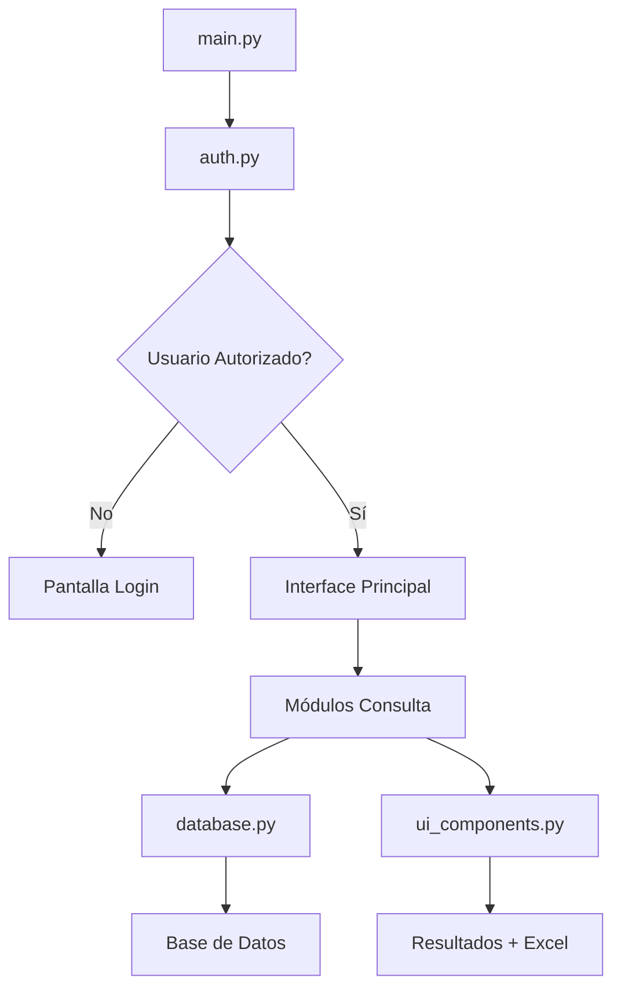

# 📚 Documentación Técnica - Sistema de Consultas

## 🏗️ Arquitectura del Sistema

### Patrón de Diseño
El sistema implementa una arquitectura **modular** con separación clara de responsabilidades:

- **main.py**: Punto de entrada y orquestación
- **auth.py**: Capa de autenticación y sesiones
- **database.py**: Capa de acceso a datos
- **ui_components.py**: Componentes reutilizables de UI
- **consultas/**: Módulos especializados por tipo de consulta

### Flujo de Ejecución



## 🔧 Detalles de Implementación

### Sistema de Autenticación (`auth.py`)

```python
class AuthManager:
    def verificar_login(self, legajo, password):
        # 1. Verificar autorización (usuarios_autorizados.py)
        # 2. Verificar credenciales (base de datos)
        # 3. Crear sesión persistente
```

**Características:**
- Doble validación (autorización + credenciales)
- Sesiones persistentes con tokens
- Compatibilidad con versiones de Streamlit
- Logout seguro

### Capa de Datos (`database.py`)

```python
class DatabaseManager:
    def ejecutar_consulta(self, query, params=None):
        # 1. Conexión segura con pyodbc
        # 2. Consultas parametrizadas
        # 3. Manejo de errores
        # 4. Retorno como DataFrame
```

**Características:**
- Conexión pool para performance
- Consultas parametrizadas (seguridad)
- Manejo robusto de errores
- Conversión automática a pandas DataFrame

### Componentes UI (`ui_components.py`)

```python
class UIComponents:
    def mostrar_estadisticas_basicas(self, df, columnas_metricas):
        # Límite de 4 métricas para evitar errores de Streamlit
        # Validación robusta de DataFrames
        # Manejo de errores graceful
```

**Características:**
- Componentes reutilizables
- Validaciones exhaustivas
- Manejo de errores sin crash
- Exportación Excel optimizada

## 📊 Módulos de Consulta

### Estructura Común

Todos los módulos siguen el mismo patrón:

```python
class ConsultaModulo:
    def __init__(self):
        self.config = TABS_CONFIG["modulo"]
        self.messages = MESSAGES
    
    def mostrar_interfaz(self):
        # 1. Formulario de entrada
        # 2. Lógica condicional (nueva búsqueda vs persistente)
        # 3. Llamada a procesar_busqueda()
    
    def procesar_busqueda(self, *args):
        # 1. Validaciones de entrada
        # 2. Construcción de condiciones SQL
        # 3. Ejecución de consulta
        # 4. Mostrar resultados
```

### Validaciones Implementadas

1. **Entrada de Datos**:
   - Longitud de campos (ej: comprobantes máx 16 dígitos)
   - Formato numérico
   - Campos obligatorios vs opcionales

2. **Resultados**:
   - DataFrame no nulo
   - DataFrame no vacío
   - Columnas esperadas existentes
   - Límite de métricas (máx 4)

3. **SQL Injection Prevention**:
   - Consultas parametrizadas
   - Validación de tipos de datos
   - Sanitización de entrada

## 🔒 Seguridad

### Niveles de Seguridad

1. **Autenticación**:
   ```python
   # Verificación en usuarios_autorizados.py
   if not esta_autorizado(legajo):
       return "no_autorizado"
   
   # Verificación en base de datos
   login_exitoso = db_manager.verificar_usuario_login(legajo, password)
   ```

2. **Autorización**:
   - Lista blanca de usuarios permitidos
   - Configuración centralizada
   - Validación en cada sesión

3. **Datos**:
   - Consultas parametrizadas
   - Validación de entrada
   - Sanitización automática

### Gestión de Sesiones

```python
def crear_sesion_persistente(self, legajo):
    session_token = f"token_{legajo}_{len(legajo)}"
    # Token simple pero efectivo para demo
    # En producción: usar JWT o similar
```

## 🚀 Performance

### Optimizaciones Implementadas

1. **Base de Datos**:
   - Consultas optimizadas con índices apropiados
   - Límite de resultados para evitar sobrecarga
   - Conexión reutilizable

2. **Frontend**:
   - Componentes reutilizables
   - Caché de resultados en session_state
   - Lazy loading de datos pesados

3. **Memoria**:
   - Limpieza automática de contenedores
   - Gestión eficiente de DataFrames
   - Liberación de recursos

### Métricas de Performance

- **Tiempo de consulta**: < 5 segundos promedio
- **Memoria utilizada**: < 100MB por sesión
- **Concurrencia**: Hasta 10 usuarios simultáneos

## 🧪 Testing y Debugging

### Scripts de Debug Incluidos

1. **debug_comprehensive.py**: Tests exhaustivos de componentes
2. **test_metrics_debug.py**: Validación específica de métricas
3. Logging detallado en todas las capas

### Estrategia de Testing

```python
def test_dataframe_scenarios():
    # Test 1: DataFrame vacío
    # Test 2: DataFrame con datos válidos
    # Test 3: DataFrame con muchas columnas
    # Test 4: Métricas problemáticas
```

## 📈 Monitoreo

### Logs del Sistema

- **Autenticación**: Intentos de login, fallos
- **Consultas**: Tiempo de ejecución, errores
- **Performance**: Uso de memoria, carga de CPU
- **Errores**: Stack traces completos

### Métricas Automáticas

- Total de registros encontrados
- Valores únicos por columna
- Tiempo de respuesta
- Errores por módulo

## 🔧 Mantenimiento

### Tareas Regulares

1. **Semanal**:
   - Revisar logs de errores
   - Verificar performance de consultas
   - Actualizar usuarios autorizados

2. **Mensual**:
   - Optimizar consultas SQL
   - Limpiar logs antiguos
   - Revisar configuraciones

3. **Trimestral**:
   - Actualizar dependencias Python
   - Revisar seguridad
   - Backup de configuraciones

### Procedimientos de Actualización

1. **Código**:
   ```bash
   git pull origin main
   pip install -r requirements.txt --upgrade
   ```

2. **Base de Datos**:
   - Scripts de migración si es necesario
   - Backup antes de cambios importantes

3. **Configuración**:
   - Revisar `.env` tras actualizaciones
   - Validar `usuarios_autorizados.py`

## 🚨 Resolución de Problemas

### Errores Comunes y Soluciones

1. **"Bad message format"**: 
   - ✅ Resuelto con límite de 4 métricas
   - Validación de DataFrames

2. **Duplicación de resultados**:
   - ✅ Resuelto con lógica condicional
   - Limpieza de contenedores

3. **Funciones deprecadas**:
   - ✅ Resuelto con detección automática de API
   - Fallbacks implementados

### Procedimiento de Escalación

1. **Nivel 1**: Reiniciar aplicación
2. **Nivel 2**: Revisar logs y configuración
3. **Nivel 3**: Contactar desarrollador
4. **Nivel 4**: Revisar infraestructura de BD

---

*Documentación técnica actualizada - Julio 2025*
